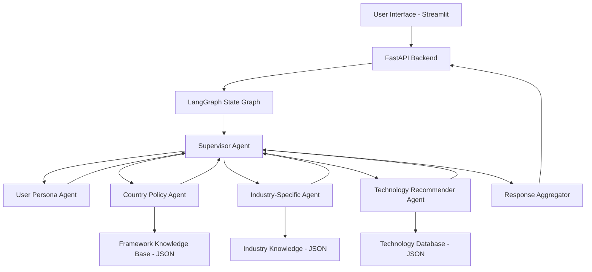
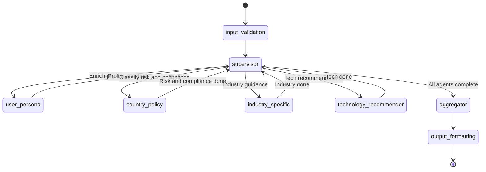

# Design Document: AI Governance Framework Helper

## Overview

The AI Governance Framework Helper is a multi-agent application built on the LangGraph platform using OpenAI GPT models. It employs a supervisor-based orchestration pattern where specialized agents collaborate to provide comprehensive AI governance guidance.

The system takes a user's AI project details, selected governance frameworks, and preferences, then routes the request through a graph of specialized agents that each contribute domain-specific knowledge. The supervisor agent coordinates the workflow, aggregating outputs from country-specific policy agents, industry-specific agents, technology recommender agents, and a user persona agent into a unified compliance advisory response.

### Key Design Decisions

1. **LangGraph State Graph** - Chosen for its native support of cyclic agent workflows, conditional routing, and persistent state. The state graph enables the supervisor to dynamically route to agents based on user input.
2. **Supervisor Pattern** - A single supervisor node manages agent dispatch rather than peer-to-peer communication. This simplifies reasoning about control flow and makes the system easier to debug.
3. **OpenAI GPT-4 as backbone** - All agents use GPT-4 (or GPT-4o) for reasoning, with specialized system prompts and tool bindings per agent.
4. **Modular Agent Design** - Each agent is a self-contained LangGraph node with its own prompt template, tools, and output schema. Agents can be added, removed, or updated independently.
5. **Structured Knowledge Base** - Governance framework data is stored as structured JSON files, enabling updates without code changes. Agents retrieve framework data via tools rather than embedding it in prompts.
6. **Deterministic Validation Layer** - Input validation and basic risk classification rules use deterministic logic (Pydantic models, rule engine) to ensure auditability, while LLM agents handle nuanced reasoning.

## Architecture

### High-Level System Diagram



### LangGraph State Graph Flow


### Agent Communication Pattern

Agents communicate exclusively through the shared LangGraph state object. The supervisor reads the current state, decides which agent(s) to invoke next, and each agent writes its output back to the state. This avoids direct agent-to-agent coupling.

```
Execution Flow:
1. User input -> State.project_profile, State.selected_frameworks, State.detail_level
2. Input validation node validates and rejects invalid input
3. Supervisor reads state -> dispatches to User Persona Agent
4. User Persona Agent enriches State.enriched_profile
5. Supervisor reads state -> dispatches Country Policy Agent + Industry Agent (parallel)
6. Country Policy Agent writes State.risk_classifications, State.compliance_obligations
7. Industry Agent writes State.industry_guidance
8. Supervisor reads state -> dispatches Technology Recommender Agent
9. Technology Recommender writes State.technology_recommendations
10. Supervisor -> Aggregator combines all state into final ComplianceAdvice
```

### Parallel Execution

The Country Policy Agent and Industry-Specific Agent can execute in parallel since they have no data dependencies on each other (both depend only on the enriched profile). LangGraph supports this via branching in the state graph.

The Technology Recommender Agent runs after both complete because it needs governance constraints (from Country Policy) and industry context (from Industry Agent) to filter recommendations by data residency.

## Components and Interfaces

### Agent Definitions

#### 1. Supervisor Agent

**Responsibility:** Orchestrates the overall workflow. Determines which agents to invoke, in what order, and whether to request clarification from the user.

**Implementation:** Uses a GPT-4 function-calling model with a routing schema. The supervisor's system prompt describes the available agents and their capabilities. It outputs a structured routing decision.

**Routing Logic:**
```python
def supervisor_router(state: GraphState) -> str:
    if not state.get("profile_valid"):
        return "user_persona"
    if not state.get("risk_classifications"):
        return "parallel_analysis"  # country_policy + industry_specific
    if not state.get("technology_recommendations"):
        return "technology_recommender"
    return "aggregator"
```

**Input:** Full graph state
**Output:** Next node name (routing decision)

#### 2. User Persona Agent

**Responsibility:** Validates project profiles, determines appropriate detail level, and enriches the project profile with inferred metadata (e.g., inferring risk indicators from the description).

**System Prompt:** Expert in AI project analysis. Validates completeness, infers missing context from descriptions, and normalizes user input into structured attributes.

**Tools:**
- `validate_profile(profile: dict) -> ValidationResult` - Check required fields, length constraints
- `enrich_profile(profile: dict) -> dict` - Add inferred attributes (risk indicators, use case category)
- `determine_detail_level(preference: str) -> DetailLevel` - Map user preference to enum

**Input:** Raw project profile from user
**Output:** Validated/enriched profile, detail level, validation errors if any

#### 3. Country-Specific Policy Agent

**Responsibility:** Provides governance framework knowledge for specific jurisdictions. Performs risk classification and generates framework-specific compliance obligations.

**Supported Frameworks:**
- EU AI Act
- Singapore Model AI Governance Framework
- US NIST AI Risk Management Framework (AI RMF)
- UK AI Regulation Policy
- Canada Artificial Intelligence and Data Act (AIDA)
- Australia AI Ethics Framework
- ISO 42001 (AI Management System Standard)

**System Prompt:** Expert in international AI governance regulations. Deep knowledge of risk classification criteria, compliance obligations, timelines, and cross-framework analysis.

**Tools:**
- `classify_risk(profile: dict, framework: str) -> RiskClassification` - Determine risk tier
- `get_obligations(framework: str, risk_level: str) -> list[Obligation]` - Retrieve obligations
- `compare_frameworks(frameworks: list[str], profile: dict) -> FrameworkComparison` - Cross-framework analysis
- `get_framework_metadata(framework: str) -> FrameworkMetadata` - Last updated date, version

**Input:** Enriched project profile, selected frameworks
**Output:** Risk classification per framework, compliance obligations, cross-framework comparison

#### 4. Industry-Specific Agent

**Responsibility:** Provides industry-tailored compliance guidance. Understands sector-specific regulations, common AI use cases, and industry best practices that intersect with governance requirements.

**Supported Industries:** Banking, Insurance, Health, Retail, Technology, Government, Education, Manufacturing, Telecommunications

**System Prompt:** Expert in industry-specific AI regulations and best practices. Understands how general governance frameworks apply differently across sectors.

**Tools:**
- `get_industry_context(industry: str) -> IndustryContext` - Sector-specific regulatory landscape
- `map_industry_obligations(industry: str, framework: str) -> list[Obligation]` - Map obligations to industry
- `get_industry_best_practices(industry: str, use_case: str) -> list[str]` - Best practices

**Input:** Enriched project profile (industry sector, use case), selected frameworks
**Output:** Industry-specific compliance guidance, additional obligations, best practices

#### 5. Technology Recommender Agent

**Responsibility:** Recommends cloud platforms, AI orchestration frameworks, and LLM models that align with governance requirements and project needs.

**System Prompt:** Expert in AI technology landscape. Knows cloud platform capabilities (AWS, Azure, GCP), orchestration frameworks (LangGraph, LangChain, Semantic Kernel, Bedrock Agents), and LLM models. Understands data residency, compliance certifications, and regional availability.

**Tools:**
- `recommend_platforms(profile: dict, constraints: dict) -> list[PlatformRec]` - Cloud platforms
- `recommend_orchestration(project_type: str, complexity: str) -> list[OrchRec]` - Frameworks
- `recommend_models(requirements: dict) -> list[ModelRec]` - LLM models
- `filter_by_residency(recommendations: list, regions: list[str]) -> list` - Filter by residency

**Input:** Enriched project profile, governance constraints (data residency from Country Policy Agent)
**Output:** Categorized technology recommendations with pros/cons
### LangGraph Graph Construction

```python
from langgraph.graph import StateGraph, END

def build_governance_graph() -> StateGraph:
    graph = StateGraph(GraphState)
    
    # Add nodes
    graph.add_node("input_validation", input_validation_node)
    graph.add_node("supervisor", supervisor_node)
    graph.add_node("user_persona", user_persona_agent)
    graph.add_node("country_policy", country_policy_agent)
    graph.add_node("industry_specific", industry_specific_agent)
    graph.add_node("technology_recommender", technology_recommender_agent)
    graph.add_node("aggregator", aggregator_node)
    graph.add_node("output_formatting", output_formatting_node)
    
    # Set entry point
    graph.set_entry_point("input_validation")
    
    # Add edges
    graph.add_edge("input_validation", "supervisor")
    graph.add_conditional_edges("supervisor", supervisor_router, {
        "user_persona": "user_persona",
        "country_policy": "country_policy",
        "industry_specific": "industry_specific",
        "technology_recommender": "technology_recommender",
        "aggregator": "aggregator",
    })
    graph.add_edge("user_persona", "supervisor")
    graph.add_edge("country_policy", "supervisor")
    graph.add_edge("industry_specific", "supervisor")
    graph.add_edge("technology_recommender", "supervisor")
    graph.add_edge("aggregator", "output_formatting")
    graph.add_edge("output_formatting", END)
    
    return graph.compile()
```

### API Interface (FastAPI)

```python
from fastapi import FastAPI
from pydantic import BaseModel

app = FastAPI(title="AI Governance Framework Helper")

@app.post("/api/v1/projects", response_model=ProjectProfile)
async def create_project(input_data: ProjectProfileInput) -> ProjectProfile:
    """Create and validate a new project profile."""
    ...

@app.post("/api/v1/advice", response_model=ComplianceAdvice)
async def generate_advice(request: AdviceRequest) -> ComplianceAdvice:
    """Run the full multi-agent workflow and return compliance advice."""
    ...

@app.get("/api/v1/frameworks", response_model=list[FrameworkSummary])
async def list_frameworks() -> list[FrameworkSummary]:
    """List available governance frameworks with summaries."""
    ...

@app.get("/api/v1/frameworks/{framework_id}", response_model=FrameworkDetail)
async def get_framework(framework_id: str) -> FrameworkDetail:
    """Get detailed information about a specific framework."""
    ...

@app.post("/api/v1/export")
async def export_advice(request: ExportRequest) -> FileResponse:
    """Export compliance advice as PDF or Markdown."""
    ...

@app.get("/api/v1/industries", response_model=list[IndustrySummary])
async def list_industries() -> list[IndustrySummary]:
    """List supported industry sectors."""
    ...
```

## Data Models

### Core Enumerations

```python
from enum import Enum

class IndustrySector(str, Enum):
    BANKING = "banking"
    INSURANCE = "insurance"
    HEALTH = "health"
    RETAIL = "retail"
    TECHNOLOGY = "technology"
    GOVERNMENT = "government"
    EDUCATION = "education"
    MANUFACTURING = "manufacturing"
    TELECOMMUNICATIONS = "telecommunications"

class DetailLevel(str, Enum):
    EXECUTIVE_SUMMARY = "executive_summary"
    STANDARD = "standard"
    DETAILED = "detailed"

class RiskLevel(str, Enum):
    UNACCEPTABLE = "unacceptable"
    HIGH = "high"
    LIMITED = "limited"
    MINIMAL = "minimal"

class GovernanceFrameworkId(str, Enum):
    EU_AI_ACT = "eu_ai_act"
    SINGAPORE_MAIGF = "singapore_maigf"
    US_NIST_AI_RMF = "us_nist_ai_rmf"
    UK_AI_REGULATION = "uk_ai_regulation"
    CANADA_AIDA = "canada_aida"
    AUSTRALIA_AI_ETHICS = "australia_ai_ethics"
    ISO_42001 = "iso_42001"

class AdviceCategory(str, Enum):
    DATA_GOVERNANCE = "data_governance"
    TRANSPARENCY = "transparency"
    ACCOUNTABILITY = "accountability"
    FAIRNESS = "fairness"
    SAFETY = "safety"
    HUMAN_OVERSIGHT = "human_oversight"

class TechCategory(str, Enum):
    CLOUD_PLATFORM = "cloud_platform"
    ORCHESTRATION_FRAMEWORK = "orchestration_framework"
    LLM_MODEL = "llm_model"
```

### Project Profile Models

```python
from pydantic import BaseModel, Field
from datetime import datetime
from typing import Optional

class ProjectProfileInput(BaseModel):
    """User-submitted project information."""
    name: str = Field(min_length=1, max_length=200)
    description: str = Field(min_length=50, max_length=5000)
    ai_techniques: list[str] = Field(min_length=1)
    data_types: list[str] = Field(min_length=1)
    deployment_region: str
    target_users: str
    intended_purpose: str
    industry_sector: IndustrySector

class ProjectProfile(ProjectProfileInput):
    """Validated and stored project profile."""
    id: str
    created_at: datetime
    updated_at: datetime
```

### Risk and Compliance Models

```python
class RiskClassification(BaseModel):
    framework: GovernanceFrameworkId
    risk_level: RiskLevel
    explanation: str
    key_factors: list[str]
    regulatory_obligations: list[str]
    is_flagged: bool = Field(description="True if risk is high or unacceptable")

class ComplianceObligation(BaseModel):
    category: AdviceCategory
    obligation: str
    recommended_actions: list[str]
    documentation_requirements: list[str]
    timeline: Optional[str] = None
    framework_reference: str  # e.g., "EU AI Act, Article 9"
    priority: str  # "high", "medium", "low"

class FrameworkComparison(BaseModel):
    frameworks: list[GovernanceFrameworkId]
    overlapping_requirements: list[str]
    conflicting_requirements: list[dict]
    harmonized_approach: str
```

### Technology Recommendation Models

```python
class TechnologyRecommendation(BaseModel):
    category: TechCategory
    name: str
    provider: str
    description: str
    key_capabilities: list[str]
    pros: list[str]
    cons: list[str]
    compliance_notes: str
    context_window: Optional[int] = None
    cost_per_token: Optional[str] = None
    supported_regions: Optional[list[str]] = None
```
### Advice Output Models

```python
class ComplianceAdvice(BaseModel):
    id: str
    project_id: str
    frameworks: list[GovernanceFrameworkId]
    detail_level: DetailLevel
    risk_classifications: list[RiskClassification]
    obligations: list[ComplianceObligation]
    framework_comparison: Optional[FrameworkComparison] = None
    industry_guidance: str
    technology_recommendations: list[TechnologyRecommendation]
    generated_at: datetime
    disclaimer: str = "This advice is informational and does not constitute legal counsel."

class ExportDocument(BaseModel):
    advice_id: str
    format: str  # "pdf" or "markdown"
    project_summary: ProjectProfile
    content: ComplianceAdvice
    timestamp: datetime
    version: str
```

### LangGraph State Model

```python
from typing import Annotated, Optional, TypedDict
from langgraph.graph.message import add_messages

class GraphState(TypedDict):
    """Shared state across all agents in the LangGraph state graph."""
    
    # Input state
    project_profile: Optional[ProjectProfileInput]
    selected_frameworks: list[GovernanceFrameworkId]
    detail_level: DetailLevel
    
    # Agent routing state
    next_agent: str
    agents_completed: list[str]
    requires_clarification: bool
    clarification_questions: list[str]
    
    # User Persona Agent output
    enriched_profile: Optional[dict]
    profile_valid: bool
    validation_errors: list[str]
    
    # Country Policy Agent output
    risk_classifications: list[RiskClassification]
    compliance_obligations: list[ComplianceObligation]
    framework_comparison: Optional[FrameworkComparison]
    framework_metadata: list[dict]
    
    # Industry Agent output
    industry_guidance: str
    industry_best_practices: list[str]
    additional_obligations: list[ComplianceObligation]
    
    # Technology Recommender Agent output
    technology_recommendations: list[TechnologyRecommendation]
    governance_constraints: dict
    
    # Final output
    final_advice: Optional[ComplianceAdvice]
    
    # Messages for agent reasoning
    messages: Annotated[list, add_messages]
```

### Governance Framework Data Sources

The knowledge base is curated from official government and standards body publications. Each framework JSON file references its authoritative source for traceability and updates.

| Framework | Primary Source | URL |
|---|---|---|
| EU AI Act | EU AI Act Explorer (artificialintelligenceact.eu) | https://artificialintelligenceact.eu/ |
| UK AI Regulation | UK Gov - Implementing AI Regulatory Principles (PDF) | https://assets.publishing.service.gov.uk/media/65c0b6bd63a23d0013c821a0/implementing_the_uk_ai_regulatory_principles_guidance_for_regulators.pdf |
| Singapore MAIGF | PDPC / IMDA Model AI Governance Framework | https://www.pdpc.gov.sg/help-and-resources/2020/01/model-ai-governance-framework |
| US NIST AI RMF | NIST AI 100-1 Risk Management Framework | https://www.nist.gov/artificial-intelligence/executive-order-safe-secure-and-trustworthy-artificial-intelligence |
| Canada AIDA | Parliament of Canada - Artificial Intelligence and Data Act | https://www.parl.ca/legisinfo/en/bill/44-1/c-27 |
| Australia AI Ethics | Department of Industry - AI Ethics Framework | https://www.industry.gov.au/publications/australias-artificial-intelligence-ethics-framework |
| ISO 42001 | ISO - AI Management System Standard | https://www.iso.org/standard/81230.html |

**EU AI Act specifics:** The site provides article-by-article text at `/article/{number}/` URLs. Key articles for risk classification: Article 5 (Prohibited Practices), Article 6 (High-Risk Classification), Annex III (High-Risk Use Cases). The Country Policy Agent references these directly.

**UK AI Regulation specifics:** The UK uses a principles-based approach (not risk tiers). The five principles are: (1) Safety, security and robustness, (2) Appropriate transparency and explainability, (3) Fairness, (4) Accountability and governance, (5) Contestability and redress. The Country Policy Agent performs a principle-based assessment and maps to relevant sector regulators (FCA, ICO, Ofcom, MHRA, etc.) based on the user's industry.

### Framework Knowledge Base Schema

```python
class FrameworkKnowledge(BaseModel):
    """Stored as JSON files in data/frameworks/."""
    framework_id: GovernanceFrameworkId
    display_name: str
    country_or_region: str
    summary: str
    last_updated: datetime
    version: str
    risk_tiers: list[RiskTierDefinition]
    key_obligations: list[ObligationDefinition]
    data_residency_requirements: Optional[list[str]] = None
    enforcement_timeline: Optional[str] = None
    recent_changes: Optional[list[str]] = None

class RiskTierDefinition(BaseModel):
    tier_name: str
    risk_level: RiskLevel
    description: str
    criteria: list[str]  # Conditions that place a project in this tier

class ObligationDefinition(BaseModel):
    obligation: str
    article_reference: str
    applies_to_risk_levels: list[RiskLevel]
    category: AdviceCategory
```

### Validation Models

```python
class ValidationResult(BaseModel):
    valid: bool
    errors: list[ValidationError] = []
    
class ValidationError(BaseModel):
    field: str
    message: str
    code: str  # e.g., "required", "min_length", "invalid_value"
```
## Correctness Properties

*A property is a characteristic or behavior that should hold true across all valid executions of a system - essentially, a formal statement about what the system should do. Properties serve as the bridge between human-readable specifications and machine-verifiable correctness guarantees.*

### Property 1: Valid input produces valid profile

*For any* set of project inputs where all required fields are present and within constraints (name 1-200 chars, description 50-5000 chars, at least one AI technique, at least one data type, valid industry sector), submitting the input SHALL produce a valid ProjectProfile with matching data and a generated ID.

**Validates: Requirements 1.2**

### Property 2: Missing fields produce field-specific errors

*For any* subset of required fields that are omitted from a project input submission, the validation result SHALL contain exactly one error for each missing field, and the error's field name SHALL match the omitted field.

**Validates: Requirements 1.3**

### Property 3: Description length boundary validation

*For any* string of length less than 50 or greater than 5000 characters, submitting it as a project description SHALL be rejected with a validation error. For any string of length between 50 and 5000 inclusive, it SHALL be accepted.

**Validates: Requirements 1.5**

### Property 4: Risk classification completeness

*For any* valid ProjectProfile and any selected GovernanceFramework, the risk classification output SHALL contain a valid RiskLevel value, a non-empty explanation string, and at least one key_factor entry.

**Validates: Requirements 3.1, 3.2**

### Property 5: High-risk flagging invariant

*For any* RiskClassification where risk_level is "high" or "unacceptable", the is_flagged field SHALL be True and the regulatory_obligations list SHALL be non-empty.

**Validates: Requirements 3.3**

### Property 6: Insufficient information triggers clarification

*For any* ProjectProfile where critical context fields (ai_techniques, data_types, intended_purpose) contain only generic or ambiguous values, the system SHALL set requires_clarification to True and provide at least one clarification question.

**Validates: Requirements 3.4**

### Property 7: Compliance advice structural completeness

*For any* generated ComplianceObligation, the obligation field SHALL be non-empty, recommended_actions SHALL contain at least one item, documentation_requirements SHALL contain at least one item, and framework_reference SHALL be a non-empty string referencing a specific article or section.

**Validates: Requirements 4.2, 4.5**

### Property 8: Advice category taxonomy

*For any* generated ComplianceObligation, the category field SHALL be one of: data_governance, transparency, accountability, fairness, safety, or human_oversight.

**Validates: Requirements 4.3**

### Property 9: Multi-framework comparison completeness

*For any* set of two or more selected frameworks, the generated FrameworkComparison SHALL contain a non-empty overlapping_requirements list and a non-empty harmonized_approach string. If conflicting requirements exist between the frameworks, conflicting_requirements SHALL be non-empty.

**Validates: Requirements 2.3, 4.4**

### Property 10: Executive summary word limit

*For any* advice generation request with detail_level set to "executive_summary", the total word count of the combined advice text (industry_guidance + all obligation descriptions) SHALL not exceed 500 words.

**Validates: Requirements 5.2**

### Property 11: Export document completeness

*For any* generated ExportDocument, it SHALL contain a non-null project_summary, the full ComplianceAdvice content, a valid timestamp (datetime), and a non-empty version string.

**Validates: Requirements 6.2, 6.3**

### Property 12: Framework metadata currency

*For any* framework in the knowledge base, the FrameworkKnowledge record SHALL contain a valid last_updated datetime that is not in the future.

**Validates: Requirements 7.1**

### Property 13: Recent update notification

*For any* framework where last_updated is within 30 days of the current date, the system SHALL include a recent_changes notification. For any framework where last_updated is older than 30 days, no recent changes notification SHALL be shown.

**Validates: Requirements 7.2**

### Property 14: Technology recommendations category coverage and completeness

*For any* valid advice generation request, the technology_recommendations list SHALL contain at least one item with category "cloud_platform", at least one with category "orchestration_framework", and at least one with category "llm_model". Each LLM model recommendation SHALL have non-null name, provider, key_capabilities (non-empty), context_window, and cost_per_token fields.

**Validates: Requirements 8.1, 8.2, 8.3, 8.6**

### Property 15: Technology recommendations include pros and cons

*For any* TechnologyRecommendation in the output, the pros list SHALL contain at least one item and the cons list SHALL contain at least one item.

**Validates: Requirements 8.4**

### Property 16: Data residency filtering

*For any* governance framework that imposes data residency constraints on a specific set of allowed regions, all technology recommendations with supported_regions SHALL include at least one region from the allowed set. No platform recommendation SHALL be included if its supported_regions do not intersect with the framework's allowed regions.

**Validates: Requirements 8.5**
## Error Handling

### Input Validation Errors

| Error Scenario | Handling Strategy |
|---|---|
| Missing required fields | Return ValidationResult with field-specific errors; do not invoke agents |
| Description too short/long | Return length constraint error with min/max values |
| Invalid industry sector | Return enum validation error with list of valid values |
| Invalid framework selection | Return error with list of supported frameworks |
| Empty framework list | Return error prompting user to select at least one |

### Agent Execution Errors

| Error Scenario | Handling Strategy |
|---|---|
| OpenAI API timeout | Retry up to 3 times with exponential backoff (2s, 4s, 8s) |
| OpenAI rate limit | Queue request and retry after rate limit window |
| Agent produces invalid output | Supervisor retries the agent with corrective prompt |
| Agent fails after retries | Return partial results with error indicator for failed section |
| LangGraph state corruption | Log error, return 500 with correlation ID for debugging |

### Knowledge Base Errors

| Error Scenario | Handling Strategy |
|---|---|
| Framework JSON file missing | Return error indicating framework unavailable; exclude from results |
| Framework data malformed | Log warning, skip framework, notify in response |
| Technology database stale | Proceed with available data, include staleness warning |

### Export Errors

| Error Scenario | Handling Strategy |
|---|---|
| PDF generation fails | Return 500 with error message; offer Markdown as fallback |
| Advice not found for export | Return 404 with descriptive message |

### Error Response Format

```python
class ErrorResponse(BaseModel):
    error_code: str  # Machine-readable error code
    message: str  # Human-readable description
    details: Optional[list[ValidationError]] = None  # Field-level errors
    correlation_id: str  # For debugging/support
    timestamp: datetime
```

### Graceful Degradation

The system follows a graceful degradation strategy:
1. If the Industry Agent fails, return advice without industry-specific guidance (mark as unavailable)
2. If the Technology Recommender fails, return compliance advice without tech recommendations
3. If the Country Policy Agent fails for one framework but succeeds for others, return partial results
4. Always return the disclaimer regardless of partial failures

## Testing Strategy

### Property-Based Testing

This feature is suitable for property-based testing because:
- The validation logic has clear input/output behavior with a large input space
- Risk classification and advice generation have universal properties that should hold across all valid inputs
- Data model constraints (field presence, enum values, length limits) are universally quantifiable

**Library:** Hypothesis (Python)
**Configuration:** Minimum 100 iterations per property test
**Tag format:** Feature: ai-governance-framework-helper, Property {number}: {property_text}

### Test Categories

#### Unit Tests (Hypothesis property-based)
- Input validation properties (Properties 1-3)
- Risk classification invariants (Properties 4-5)
- Output structure properties (Properties 7-8, 14-15)
- Data residency filtering (Property 16)
- Framework metadata properties (Properties 12-13)
- Export completeness (Property 11)

#### Unit Tests (example-based with pytest)
- Form field presence (Requirement 1.1)
- Framework list completeness (Requirement 2.2)
- Framework summary presence (Requirement 2.4)
- Detail level enum values (Requirement 5.1)
- Default detail level behavior (Requirement 5.4)
- Export format support (Requirement 6.4)
- Disclaimer presence (Requirement 7.3)

#### Integration Tests
- End-to-end advice generation within 30 seconds (Requirement 4.1)
- PDF export generation (Requirement 6.1)
- Full LangGraph workflow execution with real OpenAI calls
- Agent communication via state graph

#### Edge Case Tests
- Empty framework selection rejection (Requirement 2.5)
- Default detail level when not specified (Requirement 5.4)
- Boundary values: description at exactly 50 and 5000 characters

### Test Architecture

```
tests/
  unit/
    test_validation.py          # Properties 1-3
    test_risk_classification.py # Properties 4-6
    test_advice_output.py       # Properties 7-10
    test_export.py              # Property 11
    test_framework_metadata.py  # Properties 12-13
    test_tech_recommendations.py # Properties 14-16
  integration/
    test_full_workflow.py       # End-to-end LangGraph execution
    test_api_endpoints.py      # FastAPI endpoint tests
    test_export_generation.py  # PDF/Markdown generation
  conftest.py                  # Shared fixtures and generators
```

### Technology Stack

| Component | Technology | Purpose |
|---|---|---|
| Language | Python 3.11+ | Primary implementation language |
| Agent Framework | LangGraph | Multi-agent orchestration with state graph |
| LLM | OpenAI GPT-4 / GPT-4o | Agent reasoning backbone |
| API Framework | FastAPI | REST API with async support |
| Data Validation | Pydantic v2 | Input/output schema validation |
| Testing | pytest + Hypothesis | Unit and property-based testing |
| PDF Export | WeasyPrint or ReportLab | PDF document generation |
| Frontend | Streamlit | Rapid prototyping UI |
| Dependency Management | Poetry | Python package management |
| Containerization | Docker | Deployment packaging |